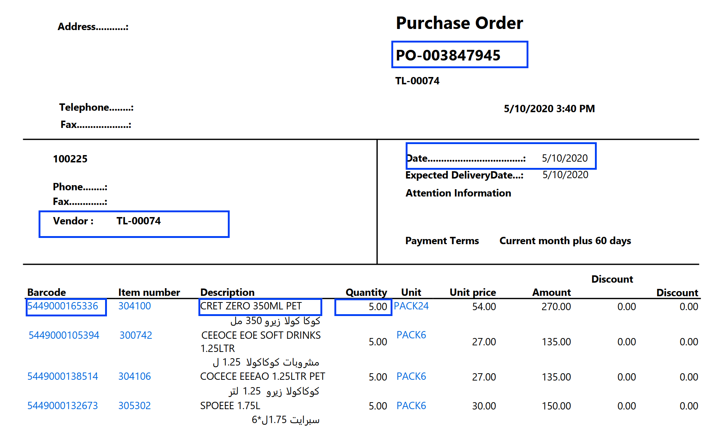

# TrapRange: a Method to Extract Table Content in PDF Files
Source: http://www.dzone.com/articles/traprange-method-extract-table

## Update

* [To extract information from PDF invoice](_Docs/invoice/README.md)
* 
* To run from the command line. Type `java -jar traprange.latest.jar -h` for help OR see examples in file `test-command-line.sh`

## Introduction
Table data structure is one of the most important data structure in document, especially when exporting data from enterprise systems, data is usually in table format.

There are several data file formats that are often used to store tabular content such as CSV, text, and pdf. For the first two formats, it is quite straight forward just by opening file, loop through lines, and split cells with proper separator. The libraries to do this are quite a lot.

With PDF file, the story is completely different because it doesn't have a dedicated data definition for tabular content, something like `table`, `tr`, `td` tag in HTML. PDF is a complicated format with text data, font, styling, and also image, audio, and video, they can be mixed all together. Below is my proposed solution to data in high-density tabular content.

## How to detect a table
After some investigation, I realized that:
* `Column`: text content in cells of the same column lies on a rectangular space that does not overlap with other rectangular spaces of another column. For example, in the following image, red rectangle and blue rectangle are separated spaces
* `Row`: words in the same horizontal alignment are in the same row. But this is just sufficient condition because a cell in a row may be a multi-line cell. For example, the fourth cell in the yellow rectangle has two lines, phrases “FK to this customer’s record in” and "Ledgers table" are not in the same horizontal alignment but they are still considered in the same row. In my solution, I simply assume that content in a cell only is single-line content. Different lines in a cell are considered to belong to different rows. Therefore the content in the yellow rectangle contains two rows: 1. `{"Ledger_ID",  "|", "Sales Ledger Account", "FK to this customer's record to"}` 2.  `{NULL, NULL, NULL, "Ledgers table"}`


## PDFBox API
My library behind traprange is `PDFBox` which is the best PDF lib I know so far. To extract text from a pdf file, `PDFBox` API provides 4 classes:
* `PDDocument`: contains information of entire pdf file. In order to load a pdf file, we use method `PDDocument.load(stream: InputStream)`
* `PDPage`: represents each page in pdf document. We possibly archive a specific page content by passing the index of the page with this method: `document.getDocumentCatalog().getAllPages().get(pageIdx: int)`
* `TextPosition`: represents an individual word or character in the document. We can fetch all `TextPosition` objects of a `PDPage` by overriding method `processTextPosition(text: TextPosition)` in class `PDTextStripper`. A `TextPosition` object has methods `getX()`, `getY()`, `getWidth()`, `getHeight()` that returns its bound in page and method `getCharacter()` to get its content.

In my work, I process text chunks directly by using `TextPosition` objects. For each text chunk in PDF file, it returns a text element with the following attributes:
* x: horizontal distance from the left of the page
* y: vertical distance from the top border of the page
* maxX: equals x + width of the text chunk
* maxY: equals y+ height of the text chunk


## Trap ranges
The most important thing is identifying the bound of each row and column because if we know the bound of a row/column, we can retrieve all texts in that row/column from that we can easily extract all content inside the table and put it in a structured model. We name these bounds are `trap-ranges`. `TrapRange` has two attributes:
* `lowerBound`: contains the lower endpoint of this range
* `upperBound`: contains the upper endpoint of this range
To calculate values of `trap-ranges`, we loop through all texts of the page and project range of each text onto the horizontal and vertical axis, get the result and join them together. After looping through all texts of the page, we will calculate trap-ranges and use them to identify cell data of the table.


`Algorithm 1`: calculating trap-ranges for each pdf page:
```java
columnTrapRanges <-- []
rowTrapRanges <-- []
for each text in page
begin
     columnTrapRanges <-- join(columnTrapRanges, {text.x, text.x + text.width} )
     rowTrapRanges <-- join(rowTrapRanges, {text.y, text.y + text.height} )
end
```
After calculating `trap-ranges` for the table, we loop through all texts again and classify them into correct cells of the table.

`Algorithm 2`: classifying text chunks into correct cells:
```java
table <-- new Table()
for each text in page
begin
     rowIdx <-- in rowTrapRanges, get index of the range that containts this text
     columnIdx <-- in columnTrapRanges, get index of the range that contains this text
     table.addText(text, rowIdx, columnIdx)
end
```
## Design and implement


The above is class diagram of main classes:
* `TrapRangeBuilder`: `build()` to calculate and return ranges
* `Table`, `TableRow` and `TableCell`: for table data struture
* `PDFTableExtractor` is the most important class. It contains methods to initialize and extract table data from PDF file. Builder pattern was used here. Following is some highlighted methods in this class:
 * `setSource`: set source of the pdf file. There're 3 overloads `setSource(InputStream)`, `setSource(File)` and `setSource(String)`
 * `addPage`: to determine which pages will be processed. Default is all pages
 * `exceptPage`: to skip a page
 * `exceptLine`: to skip noisy data. All texts in these lines will be avoided.
 * `extract`: process and return result

## Example
```java
PDFTableExtractor extractor = new PDFTableExtractor();
List<Table> tables = extractor.setSource(“table.pdf”)
	.addPage(0)
	.addPage(1)
	.exceptLine(0) //the first line in each page
	.exceptLine(1) //the second line in each page
	.exceptLine(-1)//the last line in each page
	.extract();
String html = tables.get(0).toHtml();//table in html format
String csv = tables.get(0).toString();//table in csv format using semicolon as a delimiter 
```

Following are some sample results (check out and run the test file [TestExtractor.java](https://github.com/thoqbk/traprange/blob/master/src/test/java/com/giaybac/traprange/test/TestExtractor.java)):
* Sample 1: Source: [sample-1.pdf](https://github.com/thoqbk/traprange/blob/master/_Docs/sample-1.pdf), result: [sample-1.html](http://htmlpreview.github.io/?https://github.com/thoqbk/traprange/blob/master/_Docs/result/sample-1.html)
* Sample 2: Source: [sample-2.pdf](https://github.com/thoqbk/traprange/blob/master/_Docs/sample-2.pdf), result: [sample-2.html](http://htmlpreview.github.io/?https://github.com/thoqbk/traprange/blob/master/_Docs/result/sample-2.html)
* Sample 3: Source: [sample-3.pdf](https://github.com/thoqbk/traprange/blob/master/_Docs/sample-3.pdf), result: [sample-3.html](http://htmlpreview.github.io/?https://github.com/thoqbk/traprange/blob/master/_Docs/result/sample-3.html)
* Sample 4: Source: [sample-4.pdf](https://github.com/thoqbk/traprange/blob/master/_Docs/sample-4.pdf), result: [sample-4.html](http://htmlpreview.github.io/?https://github.com/thoqbk/traprange/blob/master/_Docs/result/sample-4.html)
* Sample 5: Source: [sample-5.pdf](https://github.com/thoqbk/traprange/blob/master/_Docs/sample-5.pdf), result: [sample-5.html](http://htmlpreview.github.io/?https://github.com/thoqbk/traprange/blob/master/_Docs/result/sample-5.html)

## Evaluation
In experimentation, I used pdf files having high density of table content. The results show that my implementation detects tabular content better than other open-sources: `pdftotext`, `pdftohtml`, `pdf2table`. With documents having multi tables or too much noisy data, my method does not work well. If row has cells overlapped, columns of these cells will be merged.

## Conclusion
`TrapRange` method works the best with PDF files having high density of table data. With documents have multi-table or too much noisy data, `TrapRange` is not a good choice. My method also can be implemented in other programming languages by replacing `PDFBox` by a corresponding pdf library or using command-line tool pdftohtml to extract text chunks and using these data as input data for `algorithm 1, 2`.

## System requirements
1. Java 8+
2. Maven 3+

## References
1. http://en.wikipedia.org/wiki/Portable_Document_Format
2. http://pdfbox.apache.org
3. http://ieg.ifs.tuwien.ac.at/pub/yildiz_iicai_2005.pdf
4. http://www.foolabs.com/xpdf/
5. http://ieg.ifs.tuwien.ac.at/projects/pdf2table/

## License

The MIT License (MIT)
